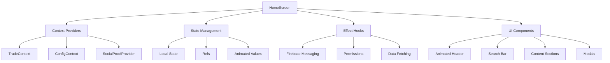
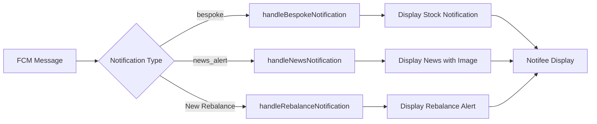
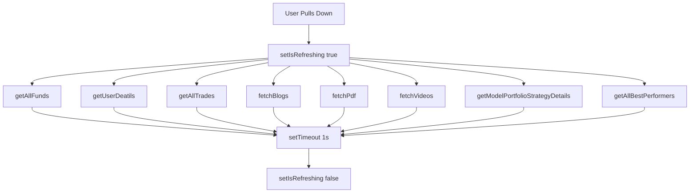

# HomeScreen Component - Deep Dive Documentation

## Table of Contents
1. [Overview](#overview)
2. [Component Architecture](#component-architecture)
3. [State Management](#state-management)
4. [Lifecycle & Effects](#lifecycle--effects)
5. [Notification System](#notification-system)
6. [UI Components Breakdown](#ui-components-breakdown)
7. [Data Flow](#data-flow)
8. [Performance Optimizations](#performance-optimizations)
9. [Styling System](#styling-system)
10. [Modal Management](#modal-management)
11. [Troubleshooting](#troubleshooting)

---

## Overview

**File:** `/src/screens/Home/HomeScreen.js`  
**Lines of Code:** 2,358  
**Component Type:** Functional Component with Hooks  
**Primary Purpose:** Main dashboard displaying trading recommendations, model portfolios, educational content, and real-time notifications

### Key Responsibilities

- Display trading recommendations (Bespoke & Rebalance)
- Show model portfolio strategies and subscription plans
- Provide educational content (Blogs, Videos, PDFs)
- Handle real-time push notifications
- Manage user interactions and navigation
- Implement pull-to-refresh functionality
- Display market data and best performers

---

## Component Architecture

### High-Level Structure



### Component Hierarchy

```
HomeScreen
├── SafeAreaView (Container)
│   ├── AnimatedSearchHeader (Conditional)
│   │   ├── LinearGradient
│   │   ├── Logo/Branding
│   │   └── Animated Text
│   ├── Search Bar (AI News Search)
│   ├── Animated.FlatList (Main Content)
│   │   ├── Model Portfolio Plans
│   │   ├── Bespoke Plans
│   │   ├── Rebalance Advices
│   │   ├── Stock Advices
│   │   └── Knowledge Hub
│   └── Modals
│       ├── Video Modal
│       ├── Blog Modal
│       ├── PDF Modal
│       └── Halal List Modal
```

---

## State Management

### Context Data (from TradeContext)

```javascript
const {
  stockRecoNotExecutedfinal,      // Unexecuted stock recommendations
  recommendationStockfinal,        // All stock recommendations
  isDatafetching,                  // Loading state for trades
  getModelPortfolioStrategyDetails, // Fetch model portfolios
  getAllTrades,                    // Fetch all trades
  modelPortfolioStrategyfinal,     // Model portfolio strategies
  rejectedTrades,                  // Rejected trade recommendations
  ignoredTrades,                   // Ignored trade recommendations
  getUserDeatils,                  // Fetch user profile
  broker,                          // Connected broker name
  funds,                           // Available funds
  getAllFunds,                     // Fetch broker funds
  isDatafetchinMP,                 // Loading state for model portfolios
  getAllBestPerformers,            // Fetch best performing stocks
  fetchVideos,                     // Fetch educational videos
  fetchPdf,                        // Fetch PDF resources
  fetchBlogs,                      // Fetch blog articles
  pdf,                             // PDF data array
  blogs,                           // Blog data array
  videos,                          // Video data array
  planList,                        // Subscription plans
  configData,                      // App configuration
} = useTrade();
```

### Local State Variables

#### Loading & UI States
```javascript
const [isLoading, setIsLoading] = useState(true);
const [isRefreshing, setIsRefreshing] = useState(false);
const [selectedTab, setSelectedTab] = useState('All');
```

#### Modal States
```javascript
const [videoModalVisible, setVideoModalVisible] = useState(false);
const [blogModalVisible, setBlogModalVisible] = useState(false);
const [pdfModalVisible, setPdfModalVisible] = useState(false);
const [showHalalList, setShowHalalList] = useState(false);
```

#### Selected Content States
```javascript
const [selectedVideo, setSelectedVideo] = useState(null);
const [selectedBlog, setSelectedBlog] = useState(null);
const [selectedPDF, setSelectedPDF] = useState(null);
```

#### View States (See All)
```javascript
const [seeAllBespoke, setSeeAllBespoke] = useState(false);
const [seeAllBespokeplan, setSeeAllBespokeplan] = useState(false);
const [seeAllMP, setSeeAllMP] = useState(false);
const [seeAllMPplan, setSeeAllMPplan] = useState(false);
const [seeAllBlogs, setSeeAllBlogs] = useState(false);
const [seeAllVideos, setSeeAllVideos] = useState(false);
const [seeAllPDFs, setSeeAllPDFs] = useState(false);
```

#### Notification & Data States
```javascript
const [notificationData, setNotificationData] = useState(null);
const [halalList, setHalalList] = useState([]);
const [halalLoading, setHalalLoading] = useState(false);
const [searchQuery, setSearchQuery] = useState('');
```

#### Permission States
```javascript
const [isNotificationPermissionGranted, setIsNotificationPermissionGranted] = useState(false);
const [isMediaPermissionGranted, setIsMediaPermissionGranted] = useState(false);
```

### Refs

```javascript
const isDataLoaded = useRef({ All: false, Bespoke: false, Rebalance: false });
const isNotificationTriggered = useRef(false);
const animation = useRef(new Animated.Value(0)).current;
const translateY = useRef(new Animated.Value(screenHeight)).current;
const scrollY = useRef(new Animated.Value(0)).current;
```

### Computed State

#### Model Portfolio Repair Trades
```javascript
const [modelPortfolioRepairTrades, setModelPortfolioRepairTrades] = useState([]);

// Fetched via getRebalanceRepair() when modelPortfolioStrategyfinal changes
```

#### Filtered and Sorted Strategies
```javascript
const filteredAndSortedStrategies = modelPortfolioStrategyfinal
  ?.sort((a, b) => new Date(b.last_updated) - new Date(a.last_updated))
  ?.map(ele => {
    const allRebalances = ele?.model?.rebalanceHistory || [];
    const sortedRebalances = allRebalances?.sort(
      (a, b) => new Date(b.rebalanceDate) - new Date(a.rebalanceDate)
    );
    const latest = sortedRebalances[0];
    
    if (!latest) return null;
    
    const userExecution = latest?.subscriberExecutions?.find(
      execution => execution?.user_email === userEmail
    );
    
    if (userExecution && userExecution.status === 'executed') {
      return null;
    }
    
    const matchingFailedTrades = modelPortfolioRepairTrades?.find(
      trade => trade.modelId === latest?.model_Id && trade.failedTrades.length !== 0
    );
    
    return {
      ...ele,
      latestRebalance: latest,
      hasFailedTrades: matchingFailedTrades,
      matchingFailedTrades,
    };
  })
  ?.filter(ele => ele !== null);
```

**Purpose:** Filters model portfolios to show only those with pending rebalances and failed trades

---

## Lifecycle & Effects

### 1. Initial Loading Effect

```javascript
useEffect(() => {
  const timeout = setTimeout(() => setIsLoading(false), 2000);
  return () => clearTimeout(timeout);
}, []);
```

**Purpose:** Show loading state for 2 seconds on initial mount

### 2. FCM Token Management

```javascript
const handleUserDataAndFcm = async () => {
  try {
    const fcmToken = await messaging().getToken();
    
    if (fcmToken) {
      const payload = {
        email: user.email,
        fcm_token: fcmToken.toString(),
      };
      
      const response = await axios.put(
        `${server.ccxtServer.baseUrl}comms/fcm/save`,
        payload,
        { headers }
      );
    }
  } catch (error) {}
};

useEffect(() => {
  handleUserDataAndFcm();
}, [user]);
```

**Purpose:** Save Firebase Cloud Messaging token for push notifications

### 3. Back Button Handler

```javascript
useFocusEffect(
  React.useCallback(() => {
    const handleBackPress = () => {
      const currentRoute = navigation.getState().routes[navigation.getState().index].name;
      const user = getAuth().currentUser;
      
      if (user && currentRoute === 'Home') {
        console.log('No back allowed');
        return true; // Prevent going back
      }
      
      navigation.goBack();
      return true;
    };
    
    BackHandler.addEventListener('hardwareBackPress', handleBackPress);
    
    return () => {
      BackHandler.removeEventListener('hardwareBackPress', handleBackPress);
    };
  }, [navigation])
);
```

**Purpose:** Prevent back navigation from Home screen when user is logged in

### 4. Rebalance Repair Fetching

```javascript
useEffect(() => {
  if (modelPortfolioStrategyfinal.length !== 0) {
    getRebalanceRepair();
  }
}, [modelPortfolioStrategyfinal]);
```

**Purpose:** Fetch failed trades when model portfolio strategies are loaded

### 5. Notification Channel Creation

```javascript
useEffect(() => {
  async function createChannel() {
    await notifee.createChannel({
      id: 'default',
      name: 'Default Channel',
      importance: AndroidImportance.HIGH,
    });
  }
  createChannel();
}, []);
```

**Purpose:** Create Android notification channel

### 6. Status Bar Styling

```javascript
useEffect(() => {
  if (Platform.OS === 'android') {
    const { StatusBar } = require('react-native');
    StatusBar.setBackgroundColor('#000000', true);
    StatusBar.setBarStyle('light-content', true);
  }
}, []);
```

**Purpose:** Set Android status bar color and style

### 7. Permission Checking

```javascript
useEffect(() => {
  checkPermissions();
}, []);

const checkPermissions = async () => {
  await checkNotificationPermission();
  await checkMediaPermission();
};
```

**Purpose:** Check and request necessary permissions on mount

### 8. Cart Items Fetching

```javascript
useEffect(() => {
  fetchCartItems();
}, []);
```

**Purpose:** Load cart items from AsyncStorage

---

## Notification System

### Architecture



### Foreground Notification Handler

```javascript
useEffect(() => {
  const unsubscribe = messaging().onMessage(async remoteMessage => {
    console.log('Foreground remoteMessage:', remoteMessage);
    
    getAllTrades(); // Refresh trades
    
    const NOTIFICATION_DELAY = 500;
    
    // Prevent duplicate notifications
    if (
      isNotificationTriggered.current &&
      Date.now() - isNotificationTriggered.current < NOTIFICATION_DELAY
    ) {
      console.warn('⏳ Blocking duplicate notification');
      return;
    }
    
    isNotificationTriggered.current = Date.now();
    
    handleNotification(remoteMessage);
    
    const title = remoteMessage?.notification?.title ?? remoteMessage?.data?.title;
    const body = remoteMessage?.notification?.body ?? remoteMessage?.data?.body;
    const { notificationType, stocks, description, image } = remoteMessage.data || {};
    
    switch (notificationType) {
      case 'bespoke':
        await handleBespokeNotification(title, body, stocks, notificationType);
        break;
      case 'news_alert':
        handleNewsNotification(title, body, notificationType, image, description);
        break;
      case 'New Rebalance':
        handleRebalanceNotification(title, body, notificationType);
        break;
      default:
        console.warn('Foreground: Unrecognized notification type');
    }
    
    setTimeout(() => {
      isNotificationTriggered.current = false;
    }, 500);
  });
  
  return unsubscribe;
}, []);
```

### Notification Types

#### 1. Bespoke Stock Advice Notification

```javascript
const handleBespokeNotification = async (title, body, stocks, notificationType) => {
  if (!stocks) return;
  
  getAllTrades();
  
  try {
    const parsedStocks = JSON.parse(stocks);
    
    if (Array.isArray(parsedStocks) && parsedStocks.length > 0) {
      if (parsedStocks.length > 1) {
        // Multiple stocks - show summary
        const stockCount = parsedStocks.length;
        const firstStock = parsedStocks[0];
        const newBody = `${firstStock.symbol} - ${firstStock.type} and ${stockCount - 1} more stocks`;
        
        await displayNotification(title, newBody, notificationType);
      } else {
        // Single stock - show detailed notification
        const { symbol, type, price, tradeId } = parsedStocks[0];
        await displayStockNotification(title, body, notificationType, symbol, type, price, tradeId);
      }
    }
  } catch (error) {
    console.error('Error parsing stocks:', error.message);
  }
};
```

**Data Structure:**
```json
{
  "notificationType": "bespoke",
  "stocks": "[{\"symbol\":\"RELIANCE\",\"type\":\"BUY\",\"price\":2500.50,\"tradeId\":\"TRD123\"}]",
  "title": "New Stock Recommendation",
  "body": "Check out the latest advice"
}
```

#### 2. News Alert Notification

```javascript
const handleNewsNotification = async (title, body, notificationType, image, description) => {
  if (!title || !body) return;
  
  const notificationConfig = {
    title: `${title}`,
    body: `<b style="color: #4caf50; font-size: 12px;">${description}</b>`,
    android: {
      channelId: 'default',
      style: { type: AndroidStyle.BIGPICTURE, picture: `${image}` },
      importance: AndroidImportance.HIGH,
      pressAction: { id: 'default' },
      color: '#E8210C',
    },
  };
  
  await notifee.displayNotification(notificationConfig);
};
```

**Features:**
- Rich media (image) support
- HTML formatted body
- Big picture style notification

#### 3. Rebalance Notification

```javascript
const handleRebalanceNotification = async (title, body, notificationType) => {
  try {
    await notifee.displayNotification({
      title: title || 'New Rebalance!',
      body: body || 'You have received a new rebalance from your advisor. Tap to review.',
      android: {
        channelId: 'default',
        importance: AndroidImportance.HIGH,
        pressAction: { id: 'default' },
        color: '#E8210C',
      },
    });
    
    getModelPortfolioStrategyDetails(); // Refresh model portfolios
  } catch (error) {
    console.error('Error displaying rebalance notification:', error);
  }
};
```

### Notification Display Functions

#### Generic Notification

```javascript
const displayNotification = async (title, body, notificationType) => {
  if (!title || !body) return;
  
  await notifee.displayNotification({
    title,
    body,
    android: {
      channelId: 'default',
      importance: AndroidImportance.HIGH,
      pressAction: { id: 'default' },
      color: '#E8210C',
    },
  });
};
```

#### Stock-Specific Notification

```javascript
const displayStockNotification = async (
  title,
  body,
  notificationType,
  symbol,
  type,
  price,
  tradeId
) => {
  if (!title || !body) return;
  
  await getAllTrades();
  
  const notificationConfig = {
    title: `${title}`,
    body: `${symbol} - ${type}`,
    android: {
      channelId: 'default',
      importance: AndroidImportance.HIGH,
      pressAction: { id: 'default' },
      color: '#E8210C',
    },
  };
  
  await notifee.displayNotification(notificationConfig);
};
```

---

## UI Components Breakdown

### 1. Animated Search Header

**Location:** Lines 989-1196

```javascript
const AnimatedSearchHeader = ({ scrollY }) => {
  const animatedTranslateY = scrollY.interpolate({
    inputRange: [0, 150],
    outputRange: [0, -290],
    extrapolate: 'clamp',
  });
  
  const animatedTextOpacity = scrollY.interpolate({
    inputRange: [0, 100],
    outputRange: [1, 0],
    extrapolate: 'clamp',
  });
  
  // ... component JSX
};
```

**Features:**
- Animated header that hides on scroll
- Gradient background
- Variant-specific branding (ARFS, Magnus, etc.)
- Opacity animation for text
- Translation animation for entire header

**Variants:**

**ARFS Variant:**
```jsx
<>
  <Text style={styles.headerText}>SMARTER INVESTING</Text>
  <Text style={styles.headerText}>WITH ARFS</Text>
  <Text style={styles.subText}>AI News | Auto Trading</Text>
  <Text style={styles.subText}>Portfolio Health | Watchlist</Text>
  <Text style={styles.subText}>All in one app</Text>
</>
```

**Magnus Variant:**
```jsx
<>
  <Text style={styles.headerText}>ACCELERATE YOUR PORTFOLIO</Text>
  <LinearGradient style={styles.magnusAIBadge}>
    <Text>ALL-IN-ONE APP</Text>
  </LinearGradient>
  <LinearGradient style={styles.magnusVerified}>
    <Text>🏛️ SEBI CERTIFIED</Text>
  </LinearGradient>
  <Text>Halal Investing • Real-time Market Analysis</Text>
  <TouchableOpacity onPress={() => setShowHalalList(true)}>
    <Text>🕌 HALAL LIST</Text>
  </TouchableOpacity>
</>
```

### 2. AI News Search Bar

**Location:** Lines 1398-1431

```javascript
<LinearGradient
  colors={['#212121', '#212121']}
  style={styles.borderGradient}>
  <TouchableOpacity
    onPress={OpenNewsScreen}
    style={styles.searchBarContainer}>
    <TextInput
      value={searchQuery}
      onChangeText={setSearchQuery}
      onPress={OpenNewsScreen}
      placeholderTextColor={'#fff'}
      style={styles.searchBar}
      placeholder="India's First AI News Search. Just Ask"
    />
    <Icon1 name="search" size={12} color={'#fff'} />
  </TouchableOpacity>
</LinearGradient>
```

**Features:**
- Gradient border effect
- Click-through to News Screen
- AI-powered search placeholder
- Custom styling

### 3. Blog Carousel

**Location:** Lines 754-796

```javascript
const BlogCarousel = () => {
  const renderBlogItem = ({ item }) => (
    <TouchableOpacity
      activeOpacity={0.8}
      onPress={() => {
        setSelectedBlog(item);
        setBlogModalVisible(true);
      }}>
      <View style={styles.blogCard}>
        <Image
          source={{ uri: item.image_base64 || item.imageUrl }}
          style={styles.blogImage}
          defaultSource={require('../../assets/default.png')}
        />
        <View style={styles.textOverlay}>
          <Text numberOfLines={2} style={styles.blogTitle}>
            {item.title}
          </Text>
          <View style={styles.timestampContainer}>
            <Clock size={16} color={'white'} />
            <Text style={styles.timestampText}>
              {convertToTimeAgo(item.created_at)}
            </Text>
          </View>
        </View>
      </View>
    </TouchableOpacity>
  );
  
  return (
    <FlatList
      data={blogs?.slice(0, 5) || []}
      renderItem={renderBlogItem}
      keyExtractor={(item, index) => index.toString()}
      horizontal
      showsHorizontalScrollIndicator={false}
      ListEmptyComponent={<EmptyStateBlogs />}
    />
  );
};
```

**Features:**
- Horizontal scrolling
- Image with text overlay
- Relative time display ("2 hours ago")
- Modal opening on tap
- Empty state handling
- Limited to 5 items

### 4. Video Carousel

**Location:** Lines 798-843

```javascript
const VideoCarousel = () => {
  const renderVideoItem = ({ item }) => (
    <TouchableOpacity
      onPress={() => {
        setSelectedVideo({ id: item.video_id, title: item.title });
        setVideoModalVisible(true);
      }}>
      <View style={styles.videoCard}>
        <Image
          style={styles.videoThumbnail}
          source={{ uri: item.thumbnail_url }}
        />
        <View style={styles.videoInfo}>
          <Text numberOfLines={1} style={styles.videoTitle}>
            {item.title}
          </Text>
          <Text style={styles.videoDetails}>
            {getTimeAgo(item.created_at)}
          </Text>
        </View>
      </View>
    </TouchableOpacity>
  );
  
  return (
    <FlatList
      data={[]} // Currently empty
      renderItem={renderVideoItem}
      horizontal
      ListEmptyComponent={<EmptyStateVideos />}
    />
  );
};
```

**Note:** Currently displays empty state as data array is empty

### 5. PDF Carousel

**Location:** Lines 939-986

```javascript
const PDFCarousel = () => {
  const handleViewPDF = async pdfItem => {
    setSelectedPDF(pdfItem);
    setPdfModalVisible(true);
  };
  
  const renderPDFItem = ({ item }) => (
    <View style={styles.pdfCard}>
      <View style={styles.pdfContent}>
        <Image source={pdfcicon} style={styles.pdfIcon} />
        <View style={styles.pdfCardContent}>
          <Text numberOfLines={1} style={styles.pdfCardTitle}>
            {item.title}
          </Text>
          <Text style={styles.pdfCardDescription}>
            {item.pages ? `${item.pages} Pages` : 'PDF'} • {formatFileSize(item.file_size)}
          </Text>
          <TouchableOpacity
            style={styles.viewButton}
            onPress={() => handleViewPDF(item)}>
            <Text style={styles.viewButtonText}>View PDF</Text>
          </TouchableOpacity>
        </View>
      </View>
      <TouchableOpacity
        style={styles.downloadButton}
        onPress={() => handleDirectDownload(item._id)}
        disabled={isLoading}>
        <Download size={25} color={isLoading ? '#ccc' : 'black'} />
      </TouchableOpacity>
    </View>
  );
  
  return (
    <FlatList
      data={pdf?.slice(0, 5) || []}
      renderItem={renderPDFItem}
      horizontal
      ListEmptyComponent={<EmptyStatePDFs />}
    />
  );
};
```

**Features:**
- PDF icon display
- File size formatting
- Page count display
- View and Download actions
- Loading state for download button

### 6. Empty State Components

```javascript
const EmptyStateBlogs = () => (
  <View style={styles.emptyStateWrapper}>
    <View style={styles.emptyStateContainer}>
      <View style={styles.emptyStateIconContainer}>
        <BookOpen size={32} color="#8B45FF" />
      </View>
      <Text style={styles.emptyStateTitle}>No Blogs Available</Text>
      <Text style={styles.emptyStateText}>
        We're working on adding valuable educational resources for you. Check back soon!
      </Text>
    </View>
  </View>
);

const EmptyStateVideos = () => (
  <View style={styles.emptyStateWrapper}>
    <View style={styles.emptyStateContainer}>
      <View style={styles.emptyStateIconContainer}>
        <Video size={32} color="#8B45FF" />
      </View>
      <Text style={styles.emptyStateTitle}>No Videos Available</Text>
      <Text style={styles.emptyStateText}>
        We're curating video tutorials and masterclasses for you. Check back soon!
      </Text>
    </View>
  </View>
);

const EmptyStatePDFs = () => (
  <View style={styles.emptyStateWrapper}>
    <View style={styles.emptyStateContainer}>
      <View style={styles.emptyStateIconContainer}>
        <FileText size={32} color="#8B45FF" />
      </View>
      <Text style={styles.emptyStateTitle}>No PDF Resources Yet</Text>
      <Text style={styles.emptyStateText}>
        We're preparing PDF guides and resources for your learning journey. Stay tuned!
      </Text>
    </View>
  </View>
);
```

**Design Pattern:**
- Centered layout
- Icon with brand color
- Title and descriptive text
- Friendly, encouraging messaging

---

## Data Flow

### Main Content Data Structure

```javascript
const allTabData = [
  // Model Portfolio Plans (Conditional)
  ...(!planList && configData?.config.REACT_APP_MODEL_PORTFOLIO_STATUS === true
    ? [{
        key: 'AllPlanDetailsmp',
        component: (
          <View>
            <Text style={styles.StockTitle}>Model Portfolios</Text>
            <ModelPortfolioScreen type="mphorizontal" />
          </View>
        ),
      }]
    : []),
  
  // Bespoke Plans (Conditional)
  ...(!planList
    ? [{
        key: 'AllPlanDetailsbespoke',
        component: (
          <View>
            <Text style={styles.StockTitle}>Top Bespoke Plans</Text>
            <ModelPortfolioScreen type="bespokehorizontal" />
          </View>
        ),
      }]
    : []),
  
  // Rebalance Advices (Conditional)
  ...(filteredAndSortedStrategies.length > 0
    ? [{
        key: 'RebalanceAdvices',
        component: (
          <View>
            <Text style={styles.StockTitle}>Portfolio Recommendations</Text>
            <RebalanceAdvices userEmail={userEmail} type={'home'} />
          </View>
        ),
      }]
    : []),
  
  // Stock Advices (Always shown)
  {
    key: 'StockAdvices',
    component: (
      <View>
        <Text style={styles.StockTitle}>Recommendations</Text>
        <StockAdvices userEmail={userEmail} type={'home'} />
      </View>
    ),
  },
  
  // Knowledge Hub (Always shown)
  {
    key: 'KnowledgeHub',
    component: (
      <View>
        <KnowledgeHub type="home" />
      </View>
    ),
  },
];
```

### Refresh Flow



```javascript
const onRefresh = () => {
  setIsRefreshing(true);
  getAllFunds();
  getUserDeatils();
  getAllTrades();
  fetchBlogs();
  fetchPdf();
  fetchVideos();
  getModelPortfolioStrategyDetails();
  getAllBestPerformers();
  
  setTimeout(() => {
    setIsRefreshing(false);
  }, 1000);
};
```

---

## Performance Optimizations

### 1. Data Caching with Refs

```javascript
const isDataLoaded = useRef({ All: false, Bespoke: false, Rebalance: false });
```

**Purpose:** Track which tabs have loaded data to prevent redundant API calls

### 2. Scroll Performance

```javascript
<Animated.FlatList
  data={allTabData}
  nestedScrollEnabled={true}
  showsVerticalScrollIndicator={false}
  onScroll={Animated.event(
    [{ nativeEvent: { contentOffset: { y: scrollY } } }],
    { useNativeDriver: true }
  )}
/>
```

**Optimizations:**
- `useNativeDriver: true` for smooth animations
- `nestedScrollEnabled` for nested scrolling
- `showsVerticalScrollIndicator={false}` to reduce rendering

### 3. Conditional Rendering

```javascript
<View
  style={{
    display: seeAllBespoke || seeAllMP || seeAllBlogs ? 'none' : 'flex',
    flex: 1,
  }}>
  {/* Main content */}
</View>
```

**Purpose:** Hide/show components instead of unmounting to preserve state

### 4. Image Optimization

```javascript
<Image
  source={{ uri: item.image_base64 || item.imageUrl }}
  style={styles.blogImage}
  defaultSource={require('../../assets/default.png')}
/>
```

**Features:**
- Default placeholder image
- Base64 or URL support
- Fallback handling

### 5. List Optimization

```javascript
<FlatList
  data={blogs?.slice(0, 5) || []}
  keyExtractor={(item, index) => index.toString()}
  horizontal
  showsHorizontalScrollIndicator={false}
/>
```

**Optimizations:**
- Limit data to 5 items
- Proper key extraction
- Hide scroll indicators

---

## Styling System

### Theme Configuration

```javascript
const selectedVariant = Config.APP_VARIANT;
const {
  logo: LogoComponent,
  themeColor,
  mainColor,
  secondaryColor,
  gradient1,
  gradient2,
  placeholderText,
} = APP_VARIANTS[selectedVariant];
```

### Responsive Dimensions

```javascript
const { height: screenHeight, width: screenWidth } = Dimensions.get('window');
```

### Gradient Styling

```javascript
<LinearGradient
  colors={[gradient1, gradient2]}
  start={{ x: 1, y: 0 }}
  end={{ x: 0, y: 1 }}
  style={styles.headerGradient}>
  {/* Content */}
</LinearGradient>
```

### Animation Styling

```javascript
const animatedFlatListPadding = scrollY.interpolate({
  inputRange: [0, 10],
  outputRange: [240, 10],
  extrapolate: 'clamp',
});
```

---

## Modal Management

### Video Modal

```javascript
<Modal
  visible={videoModalVisible}
  animationType="slide"
  onRequestClose={() => {
    setVideoModalVisible(false);
    setSelectedVideo(null);
  }}>
  <SafeAreaView style={styles.modalContainer}>
    <View style={styles.modalHeader}>
      <TouchableOpacity
        onPress={() => {
          setVideoModalVisible(false);
          setSelectedVideo(null);
        }}>
        <XIcon size={24} color="#000" />
      </TouchableOpacity>
      <Text style={styles.modalTitle}>{selectedVideo?.title}</Text>
    </View>
    <YoutubePlayer
      height={250}
      videoId={selectedVideo?.id}
      onChangeState={onStateChange}
    />
  </SafeAreaView>
</Modal>
```

### Blog Modal

```javascript
<Modal
  visible={blogModalVisible}
  animationType="slide">
  <SafeAreaView>
    <TouchableOpacity onPress={() => setBlogModalVisible(false)}>
      <XIcon size={24} />
    </TouchableOpacity>
    <ScrollView>
      <Image source={{ uri: selectedBlog?.image_base64 }} />
      <Text>{selectedBlog?.title}</Text>
      <Text>{selectedBlog?.content}</Text>
    </ScrollView>
  </SafeAreaView>
</Modal>
```

### PDF Modal

```javascript
<Modal
  visible={pdfModalVisible}
  animationType="slide">
  <SafeAreaView>
    <TouchableOpacity onPress={() => setPdfModalVisible(false)}>
      <XIcon size={24} />
    </TouchableOpacity>
    {/* PDF Viewer Component */}
  </SafeAreaView>
</Modal>
```

---

## Utility Functions

### 1. Time Formatting

```javascript
const convertToTimeAgo = dateString => {
  return moment(dateString).fromNow();
};

const getTimeAgo = dateString => {
  const now = new Date();
  const videoDate = new Date(dateString);
  const diffInSeconds = Math.floor((now - videoDate) / 1000);
  
  const intervals = [
    { label: 'year', seconds: 31536000 },
    { label: 'month', seconds: 2592000 },
    { label: 'week', seconds: 604800 },
    { label: 'day', seconds: 86400 },
    { label: 'hour', seconds: 3600 },
    { label: 'minute', seconds: 60 },
  ];
  
  for (const interval of intervals) {
    const count = Math.floor(diffInSeconds / interval.seconds);
    if (count > 1) {
      return `${count} ${interval.label}s ago`;
    } else if (count === 1) {
      return `${count} ${interval.label} ago`;
    }
  }
  
  return 'just now';
};
```

### 2. File Size Formatting

```javascript
const formatFileSize = bytes => {
  if (!bytes) return 'Unknown size';
  const mb = bytes / (1024 * 1024);
  if (mb < 1) {
    const kb = bytes / 1024;
    return `${kb.toFixed(0)} KB`;
  }
  return `${mb.toFixed(1)} MB`;
};
```

### 3. Option Symbol Formatting

```javascript
const formatOptionSymbol = (symbol) => {
  // Example: "NIFTY04NOV2522850PE" → "NIFTY 04 NOV 25 22850 PE"
  const regex = /^([A-Z]+)(\d{2})([A-Z]{3})(\d{2})(\d+)(CE|PE)$/;
  const match = symbol.match(regex);
  
  if (match) {
    const [, name, day, month, year, strike, type] = match;
    return `${name} ${day} ${month} ${year} ${strike} ${type}`;
  }
  return symbol;
};
```

### 4. PDF Download

```javascript
const handleDirectDownload = async pdfID => {
  setIsLoading(true);
  try {
    const response = await axios.get(
      `${server.ccxtServer.baseUrl}/misc/pdfs/download/${pdfID}`,
      { headers }
    );
    
    if (response.data && response.data.pdf_data) {
      await completeDownloadStatement(response.data.pdf_data);
    } else {
      showToast('PDF data not found', 'error', '');
    }
  } catch (error) {
    console.error('Error downloading PDF:', error);
    showToast('Failed to download PDF', 'error', '');
  } finally {
    setIsLoading(false);
  }
};

const completeDownloadStatement = async pdfData => {
  try {
    if (pdfData) {
      const fileName = `Educational_PDF_${new Date().getTime()}.pdf`;
      const path = Platform.OS === 'android'
        ? `${RNFS.DownloadDirectoryPath}/${fileName}`
        : `${RNFS.DocumentDirectoryPath}/${fileName}`;
      
      const binaryData = atob(pdfData);
      await RNFS.writeFile(path, binaryData, 'ascii');
      
      const fileExists = await RNFS.exists(path);
      if (fileExists) {
        showToast('PDF downloaded successfully', 'success', '');
      }
    }
  } catch (error) {
    console.error('Error saving PDF:', error);
    showToast('Error downloading PDF', 'error', '');
  }
};
```

### 5. Toast Notifications

```javascript
const showToast = (message1, type, message2) => {
  Toast.show({
    type: type,
    text2: message2 + ' ' + message1,
    position: 'bottom',
    text1Style: {
      color: 'black',
      fontSize: 11,
      fontWeight: 0,
      fontFamily: 'Poppins-Medium',
    },
    text2Style: {
      color: 'black',
      fontSize: 12,
      fontFamily: 'Poppins-Regular',
    },
  });
};
```

---

## Troubleshooting

### Common Issues

#### 1. Notifications Not Showing

**Problem:** Push notifications not displaying

**Solutions:**
- Check FCM token is saved: `console.log('FCM Token:', fcmToken)`
- Verify notification channel created
- Check notification permissions granted
- Ensure `notifee` is properly configured

**Debug:**
```javascript
const checkNotificationSetup = async () => {
  const settings = await notifee.getNotificationSettings();
  console.log('Notification settings:', settings);
  
  const fcmToken = await messaging().getToken();
  console.log('FCM Token:', fcmToken);
};
```

#### 2. Data Not Refreshing

**Problem:** Pull-to-refresh not updating data

**Solutions:**
- Check network connectivity
- Verify API endpoints are correct
- Check authentication headers
- Ensure context providers are wrapping component

**Debug:**
```javascript
const onRefresh = () => {
  console.log('Refresh started');
  setIsRefreshing(true);
  
  getAllTrades()
    .then(() => console.log('Trades refreshed'))
    .catch(err => console.error('Trades error:', err));
  
  // ... other calls
};
```

#### 3. Modals Not Opening

**Problem:** Tapping on content doesn't open modal

**Solutions:**
- Check modal state is being set
- Verify `visible` prop is correct
- Ensure `onPress` handlers are attached
- Check for z-index issues

**Debug:**
```javascript
const handleBlogPress = (item) => {
  console.log('Blog pressed:', item);
  setSelectedBlog(item);
  console.log('Setting modal visible');
  setBlogModalVisible(true);
};
```

#### 4. Scroll Animation Issues

**Problem:** Header animation not smooth

**Solutions:**
- Ensure `useNativeDriver: true` is set
- Check interpolation ranges
- Verify Animated.Value is initialized
- Test on physical device (not simulator)

**Debug:**
```javascript
const scrollY = useRef(new Animated.Value(0)).current;

scrollY.addListener(({ value }) => {
  console.log('Scroll Y:', value);
});
```

#### 5. Empty States Always Showing

**Problem:** Content not displaying, only empty states

**Solutions:**
- Check data is being fetched
- Verify data structure matches expectations
- Check conditional rendering logic
- Ensure context is providing data

**Debug:**
```javascript
console.log('Blogs data:', blogs);
console.log('Videos data:', videos);
console.log('PDF data:', pdf);
```

---

## Best Practices

### 1. State Management

✅ **Do:**
- Use context for global data
- Use local state for UI-only state
- Use refs for values that don't need re-renders

❌ **Don't:**
- Store derived data in state
- Create unnecessary state variables
- Mutate state directly

### 2. Performance

✅ **Do:**
- Use `useNativeDriver` for animations
- Implement pagination for large lists
- Memoize expensive calculations
- Limit data in horizontal lists

❌ **Don't:**
- Render large lists without optimization
- Create inline functions in render
- Perform heavy calculations in render

### 3. Error Handling

✅ **Do:**
- Wrap API calls in try-catch
- Show user-friendly error messages
- Log errors for debugging
- Provide fallback UI

❌ **Don't:**
- Ignore errors silently
- Show technical error messages to users
- Let app crash on errors

### 4. Code Organization

✅ **Do:**
- Extract reusable components
- Group related functions
- Use meaningful variable names
- Add comments for complex logic

❌ **Don't:**
- Create monolithic components
- Use cryptic variable names
- Leave commented-out code
- Duplicate logic

---

## Future Enhancements

### Planned Features

1. **Infinite Scroll** for content sections
2. **Search Functionality** for recommendations
3. **Filters** for advice types
4. **Sorting Options** for content
5. **Bookmarking** educational content
6. **Share Functionality** for blogs/videos
7. **Offline Support** with caching
8. **Dark Mode** support
9. **Accessibility** improvements
10. **Performance Metrics** tracking

---

**Last Updated:** November 2024  
**Component Version:** 1.0  
**Maintained By:** AlphaQuark Development Team
